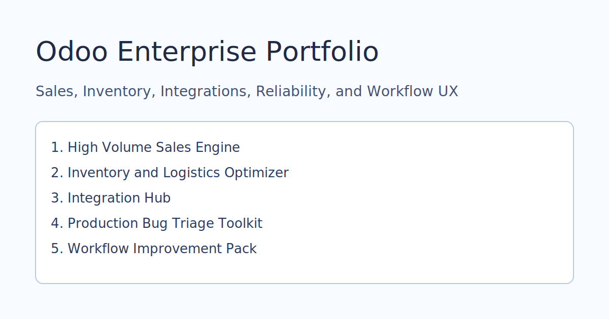

# Odoo Enterprise Portfolio

A recruiter-friendly index of five focused Odoo projects for enterprise-grade operations.

## Projects

1. [odoo-high-volume-sales-engine](https://github.com/abelfree/odoo-high-volume-sales-engine)
2. [odoo-inventory-logistics-optimizer](https://github.com/abelfree/odoo-inventory-logistics-optimizer)
3. [odoo-integration-hub](https://github.com/abelfree/odoo-integration-hub)
4. [odoo-production-bug-triage-toolkit](https://github.com/abelfree/odoo-production-bug-triage-toolkit)
5. [odoo-workflow-improvement-pack](https://github.com/abelfree/odoo-workflow-improvement-pack)

## Capability Matrix

| Capability | Repo |
|---|---|
| Scale and Throughput | `odoo-high-volume-sales-engine` |
| Inventory and Logistics | `odoo-inventory-logistics-optimizer` |
| Integration Reliability | `odoo-integration-hub` |
| Production Support | `odoo-production-bug-triage-toolkit` |
| Full-Stack UX and Backend | `odoo-workflow-improvement-pack` |

## Screenshots

